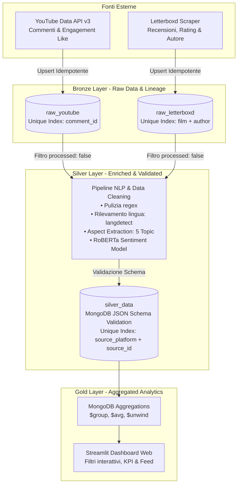

# 🎬 Sentiment Analysis & Social Listening Hub

[](https://www.python.org/)
[](https://www.mongodb.com/)
[](https://huggingface.co/)
[](https://streamlit.io/)

Piattaforma end-to-end di **Social Listening e Sentiment Analysis** per l'industria cinematografica e dei media. Il progetto adotta un approccio rigoroso basato sulla **Data Governance**, con architettura dati a livelli **Medallion (Bronze, Silver, Gold)** e persistenza su **MongoDB**.

---

## 🏛️ Architettura dei Dati & Governance



### I Pilastri della Data Governance
1. **Data Lineage:** ogni documento Bronze e Silver contiene il blocco tracciabile `_governance`:
   - `source_platform`: provenienza (`youtube`, `letterboxd`).
   - `source_id`: chiave univoca originaria per risalire al dato grezzo.
   - `extraction_timestamp`: marca temporale UTC ISO standard.
2. **Qualità del Dato & Schema Validation:** sulla collezione `silver_data` è applicata una **JSON Schema Validation** rigorosa direttamente in MongoDB (`collMod`), impedendo l'inserimento di dati privi di score, testo normalizzato o metadati di audit.
3. **Idempotenza & Deduplicazione:**
   - Indici univoci composti impediscono duplicati.
   - Gli script di ingestione utilizzano logiche di `upsert` (`$set` per aggiornare i campi e `$setOnInsert` per inizializzare `_governance.processed: False`).
   - Lo script di processing analizza unicamente i documenti non ancora processati (`_governance.processed != True`), azzerando il consumo computazionale superfluo.

---

## 🚀 Funzionalità Principali

- **Ingestione Dati Multi-piattaforma:**
  - **YouTube API v3:** estrazione commenti ordinati per rilevanza e conteggio like.
  - **Letterboxd:** crawler BeautifulSoup4 adattato al layout DOM moderno (`article.production-viewing`).
- **Analisi Sentiment con Deep Learning:**
  - Modello Transformer RoBERTa (`cardiffnlp/twitter-roberta-base-sentiment-latest`).
  - Score continuo normalizzato da `-1.0` (massima negatività) a `+1.0` (massima positività) con classificazione categorica (*Positive*, *Neutral*, *Negative*).
- **Aspect-Based Social Listening:**
  - Estrazione automatica bilingue (IT/EN) degli argomenti trattati nel commento:
    - 🎬 **`directing`**: regia, filmmaker, registi (es. Villeneuve, Nolan).
    - 🎭 **`acting`**: interpretazione, cast, attori (es. Chalamet, Butler).
    - 🎵 **`soundtrack`**: colonna sonora, musica, audio (es. Hans Zimmer).
    - 🎨 **`visuals`**: cinematografia, estetica, effetti visivi, CGI.
    - 📖 **`plot`**: trama, storia, sceneggiatura, ritmo, finale.
- **Rilevamento Automatico della Lingua:** identificazione ISO (`it`, `en`, `es`, ecc.) con libreria `langdetect`.
- **Dashboard Interattiva in Streamlit:**
  - Filtri dinamici in sidebar per piattaforma e per singolo aspetto.
  - KPI cards: totale contributi, sentiment score medio e argomento più discusso.
  - Grafici di ripartizione e sentiment medio aggregato per singolo aspetto.
  - Feed dei commenti analizzati con badge di lingua, score e aspetti rilevati.

---

## 📁 Struttura del Progetto

```text
sentiment_analysis_project/
├── config/                  # Configurazioni e parametri globali
├── docs/                    # Documentazione e Manuale Utente PDF
│   └── Manuale_Utente_Sentiment_Hub.pdf
├── scripts/                 # Script di utilità (es. generazione manuale PDF)
│   └── generate_manual_pdf.py
├── src/
│   ├── db/
│   │   ├── client.py        # Client MongoDB sincrono (pymongo) e asincrono (motor)
│   │   └── init_db.py       # Creazione collezioni, schema validation e indici univoci
│   ├── ingestion/
│   │   ├── letterboxd.py    # Scraper per Letterboxd con upsert idempotente
│   │   └── youtube.py       # Client YouTube Data API v3 con ranking per like
│   ├── processing/
│   │   └── sentiment.py     # Pipeline NLP (pulizia, lingua, aspetti, RoBERTa)
│   └── dashboard/
│       └── app.py           # Dashboard analitica Streamlit
├── Dockerfile               # Build dell'immagine Streamlit
├── .dockerignore            # Ottimizzazione del contesto Docker
├── docker-compose.yml       # Stack completo: MongoDB, Mongo Express, Dashboard
├── requirements.txt         # Dipendenze Python bloccate
├── .env.example             # Template variabili d'ambiente
└── README.md                # Documentazione tecnica
```

---

## 🛠️ Guida all'Avvio

### Modalità 1: Stack Completo con Docker (Consigliata)
Avvia MongoDB, Mongo Express e la Dashboard Streamlit con un solo comando:
```bash
docker compose up -d --build
```
- **Dashboard Streamlit:** `http://localhost:8501`
- **Mongo Express (Web GUI per DB):** `http://localhost:8081` (user: `admin`, pass: `admin`)
- **MongoDB:** `localhost:27017`

---

### Modalità 2: Esecuzione Locale con Ambiente Virtuale

#### 1. Avviare il Database MongoDB (se non già attivo)
```bash
docker run -d --name sentiment_mongodb -p 27017:27017 \
  -e MONGO_INITDB_ROOT_USERNAME=root \
  -e MONGO_INITDB_ROOT_PASSWORD=example_password \
  -v sentiment_mongodb_data:/data/db \
  --restart unless-stopped mongo:6.0
```

#### 2. Configurare l'Ambiente Python
```bash
python3 -m venv venv
source venv/bin/activate
pip install -r requirements.txt
cp .env.example .env
```
*(Inserire la propria `YOUTUBE_API_KEY` nel file `.env`).*

#### 3. Inizializzare Database, Regole di Governance e Indici
```bash
python src/db/init_db.py
```

#### 4. Eseguire l'Ingestione dei Dati (Bronze Layer)
- **Da YouTube:**
  ```bash
  python src/ingestion/youtube.py
  ```
- **Da Letterboxd:**
  ```bash
  python src/ingestion/letterboxd.py
  ```

#### 5. Elaborare i Dati con la Pipeline NLP (Silver Layer)
```bash
python src/processing/sentiment.py
```

#### 6. Lanciare la Dashboard Analitica (Gold Layer)
```bash
streamlit run src/dashboard/app.py
```
La dashboard sarà raggiungibile all'indirizzo `http://localhost:8501`.
